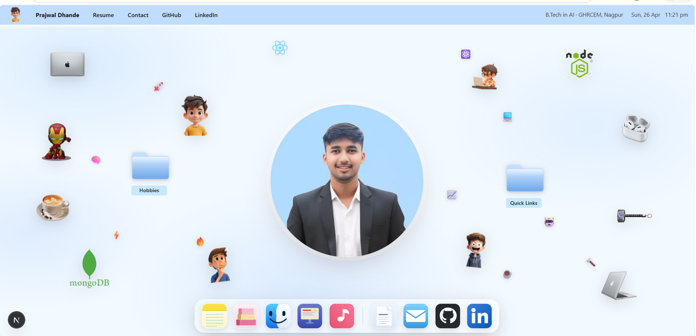

<div align="center">

<br/>

### *Hello world! I am Prajwal* ✦

**Full Stack (MERN) & AI Engineer** · B.Tech in AI @ GHRCEM, Nagpur · Building intelligent, scalable applications that actually work.

<br/>

[](https://prajwal-portfolio.vercel.app/)
[](https://www.linkedin.com/in/prajwal-dhande-57384b380)
[](https://github.com/Prajwal-Dhande)
[](mailto:prajwaldhande017@gmail.com)

<br/>

> *A fully interactive macOS-style desktop built entirely in the browser.*

<br/>



</div>

---

## ✦ What is this?

Not your average portfolio. This is a **fully functional macOS-style desktop experience** built in Next.js, where every section of my work lives inside a draggable, resizable window. Open apps from the dock, read my experience like a Keynote deck, browse my MERN & AI projects in a Finder window, and listen to my playlist in an Apple Music clone.

Everything is designed to feel native: traffic lights that close windows, a dock that bounces on hover, a lock screen that sweeps away on load, and custom emoji cursors for every app.

---

## 🖥️ The Desktop

| App | What's inside |
|-----|--------------|
| 📝 **Notes** | About me: who I am, my tech stack, and my journey |
| 📚 **Books** | Education & Credentials - academic details and professional certifications |
| 📁 **Finder** | Projects - filter by category, open any README in VS Code |
| 🎞️ **Keynote** | Experience - slide-by-slide details of my internships and hackathons |
| 🎵 **Music** | My current playlist |
| 💻 **VS Code** | Full VS Code explorer UI across all projects |
| 📄 **Resume** | Word-style viewer with one-click download |
| ✉️ **Mail** | Contact form |
| 🔗 **Folders** | Hobbies & Quick Links (LeetCode, GitHub, LinkedIn, Certificates) |

---

## ✨ Details worth noticing

- **Lock screen** - swirling lavender-to-orange gradient with a *hello world.* that hand-writes itself, then sweeps up
- **Custom cursors** - each window has its own emoji cursor: ✨ About · 💻 Projects · 🎧 Music · 💯 Resume · 🙌🏼 Experience · 👀 Desktop
- **Window management** - drag, resize, stack, close; new windows open staggered so they never perfectly overlap
- **Dock** - hover lift animation, open-app dot indicators, tooltip labels, divider between apps and links
- **Animoji stickers** - floating across the desktop with gentle keyframe animations tailored for both desktop and mobile views
- **Architecture diagrams** - every experience slide includes a workflow or system diagram, built in SVG

---

## 🛠️ Built with

| | |
|---|---|
| **Framework** | Next.js (App Router) |
| **Language** | TypeScript |
| **Backend / DB** | Node.js, Express, MongoDB (MERN Stack) |
| **Styling** | Tailwind CSS v4 |
| **Deployment** | Vercel |

---

## 🚀 Run locally

```bash
git clone [https://github.com/Prajwal-Dhande/portfolio.git](https://github.com/Prajwal-Dhande/portfolio.git)
cd portfolio

npm install
npm run dev
```

Open [http://localhost:3000](http://localhost:3000) - the lock screen will greet you. 🎉

---

## 📁 Project structure

```text
app/
  layout.tsx             # Fonts, favicon, metadata
  page.tsx               # Entry: LockScreen → Desktop
  globals.css            # All styles + custom emoji cursors

components/
  Desktop.tsx            # Dock, window manager, stickers, menu bar
  WindowChrome.tsx       # Draggable, resizable window shell
  LockScreen.tsx         # Animated gradient + hello world reveal
  AboutModal.tsx         # Notes app
  EducationModal.tsx     # Book shelf UI & Certifications
  ProjectsModal.tsx      # Finder + VS Code README viewer
  ExperienceModal.tsx    # Keynote slides + architecture diagrams
  MusicModal.tsx         # Apple Music clone
  ResumeModal.tsx        # Word-style PDF viewer
  ContactModal.tsx       # Mail app
  VscodeFolderModal.tsx  # VS Code welcome + project explorer
  HobbiesModal.tsx       # Hobbies folder
  QuickLinksModal.tsx    # Quick links & Credentials hub
```

---

## 📬 Let's connect

Whether you have a role to fill, a project in mind, or just want to say hi - my inbox is always open.

<div align="center">

| | |
|---|---|
| 💼 LinkedIn | [linkedin.com/in/prajwal-dhande](https://www.linkedin.com/in/prajwal-dhande-57384b380) |
| 💻 GitHub | [github.com/Prajwal-Dhande](https://github.com/Prajwal-Dhande) |
| 💻 LeetCode | [leetcode.com/Prajwal-Dhande](https://leetcode.com/Prajwal-Dhande) |
| ✉️ Email | [prajwaldhande017@gmail.com](mailto:prajwaldhande017@gmail.com) |

<br/>

<sub>Built by Prajwal Dhande · © 2026 · open the portfolio, it's worth it ✨</sub>

</div>